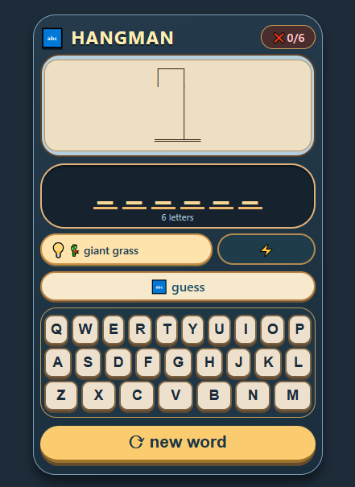

# 🎮 Hangman Game - Interactive Word Guessing

A classic Hangman word guessing game with a modern, mobile-friendly interface. Test your vocabulary with 150+ challenging words!

## ✨ Features
- 🎯 **150+ Words** | Extensive vocabulary with 4-6 letter words |
- 💡 **Smart Hints** | Every word comes with an emoji-enhanced hint |
- 📱 **Mobile First** | Fully responsive design works on all devices |
- ⌨️ **QWERTY Keyboard** | Realistic keyboard layout for laptop & mobile |
- 🎨 **Visual Feedback** | Hangman drawing updates with each wrong guess |
- 🔄 **Restart Anytime** | New word with a single click |
- 🎪 **Colorful UI** | Attractive gradient design with smooth animations |

## 🎯 How to Play
1. **Guess the word** - Try to figure out the hidden word (4-6 letters)
2. **Use hints** - Each word comes with a helpful hint (look for 💡)
3. **One letter at a time** - Click on keyboard letters to make guesses
4. **Wrong guesses** - Each wrong guess adds a part to the hangman (max 6)
5. **Win condition** - Guess all letters correctly before the hangman is complete

## 🚀 Live Demo
[Play the game here!](https://rakibhossain231hangmangame.vercel.app/)

## 🛠️ Technologies Used
- **HTML5** - Game structure
- **CSS3** - Styling with gradients, shadows, and responsive design
- **JavaScript (ES6)** - Game logic, word selection, and interactivity

## 📁 Project Structure
- hangman-game/
- │
- ├── index.html # Main HTML file
- ├── style.css # All styles and responsive design
- ├── script.js # Game logic and word database
- ├── README.md # Project documentation
- └── 1.png # Game screenshot

  
## 📱 Responsive Design
- **Desktop** - Full keyboard layout
- **Tablet** - Compact but fully functional
- **Mobile** - Touch-optimized buttons, no scrolling needed

## 📞 Contact
- Rakib Hossain
- 📧 Email: rakibrazcse@gmail.com
- 🔗 Portfolio: [Portfolio](https://rakibhossain231.vercel.app/)
- 🐙 GitHub: @RakibHossain231
- 💼 LinkedIn: @Rakibhossain231
